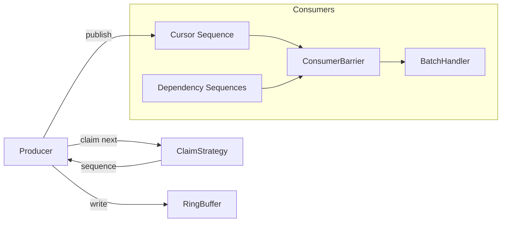
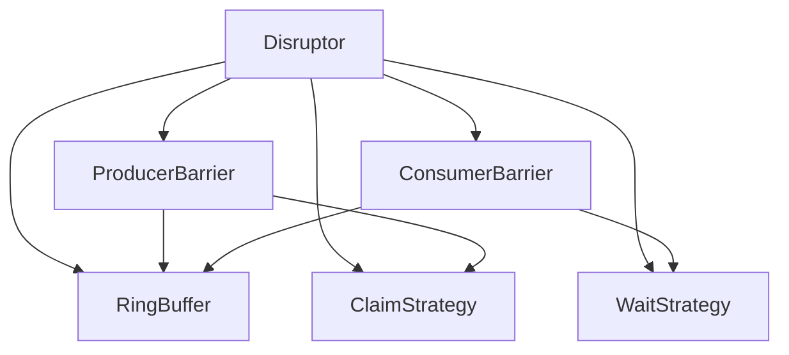

# LMAX Disruptor (C++): Single-Producer, Production-Grade Core

A clean, modular C++ implementation of the LMAX Disruptor pattern focused on **single-producer correctness**, tight memory ordering, and predictable object reuse.

## What This Is (and Is Not)

- **This is correct and optimized for a single producer.**
- **Multi-producer publishing is intentionally disabled** because correct cursor advancement requires additional ordering logic not present here.

If you need multi-producer support, you must add a publisher gate that only advances the cursor once all prior sequences are committed. This repo does not implement that logic.

## Architecture



## Component Map



## Correctness + Performance Notes

1. **Single-producer is the only supported claim strategy.**
   - Multi-producer publishing requires extra logic to advance the cursor only when all prior sequences are committed.
   - That logic is not implemented here, so multi-producer is disabled by design.

2. **Cursor advancement is monotonic.**
   - The cursor only moves forward; it never regresses.
   - This matters if any future extensions introduce alternative publishing paths.

3. **`atomic_thread_fence` in busy-spin loops is not the synchronization mechanism.**
   - The real ordering comes from `Sequence::get()`’s acquire loads and `Sequence::set()`’s release stores.
   - The fence simply reduces overly aggressive loop optimizations on some architectures.

4. **Ring buffer entries are reused, not re-allocated.**
   - Entries are constructed once and reused.
   - You can customize reuse/reset behavior with an `EntryFactory`.

## Build & Run

```bash
g++ -std=c++17 -O3 -pthread -Iinclude examples/demo.cpp -o disruptor
./disruptor
```

## Quick Start

```cpp
#include "disruptor/disruptor.h"

struct Event { int64_t value; };

class Handler : public disruptor::BatchHandler<Event> {
public:
    void onAvailable(const Event& e, int64_t, bool) override {
        // Process event
    }
};

int main() {
    disruptor::Disruptor<Event> disruptor(1024);

    Handler handler;
    auto* consumer = disruptor.createConsumer(&handler);
    auto* producer = disruptor.getProducerBarrier();

    (void)consumer;

    disruptor.start();

    int64_t seq = producer->nextEntry();
    auto& event = producer->getEntry(seq);
    event.value = 42;
    producer->commit(seq);

    disruptor.stop();
}
```

## Entry Reuse Policy

By default, entries are constructed once and reused. For heavier objects, provide a factory:

```cpp
struct Event { std::string payload; };

struct EventFactory {
    void construct(Event* ptr) const { new (ptr) Event(); }
    void destroy(Event* ptr) const { ptr->~Event(); }
    void reset(Event& e) const { e.payload.clear(); }
};

// Use custom factory
using DisruptorT = disruptor::Disruptor<Event, EventFactory>;
```

## File Layout

- `include/disruptor/sequence.h`
- `include/disruptor/sequence_group.h`
- `include/disruptor/claim_strategy.h`
- `include/disruptor/wait_strategy.h`
- `include/disruptor/ring_buffer.h`
- `include/disruptor/producer_barrier.h`
- `include/disruptor/consumer_barrier.h`
- `include/disruptor/batch_handler.h`
- `include/disruptor/consumer.h`
- `include/disruptor/disruptor.h`
- `examples/demo.cpp`

## Status

- Single-producer, single- or multi-consumer: **supported**
- Multi-producer: **intentionally disabled** (missing ordered publish gate)
- Object reuse: **supported via `EntryFactory`**
