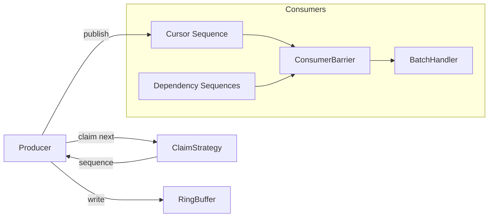
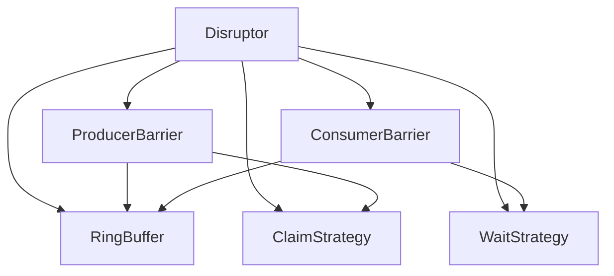

# LMAX Disruptor

An implementation of the LMAX Disruptor pattern.

## Architecture



## Component Map



## Build & Run

```bash
g++ -std=c++17 -O3 -pthread -Iinclude examples/demo.cpp -o disruptor
./disruptor
```
